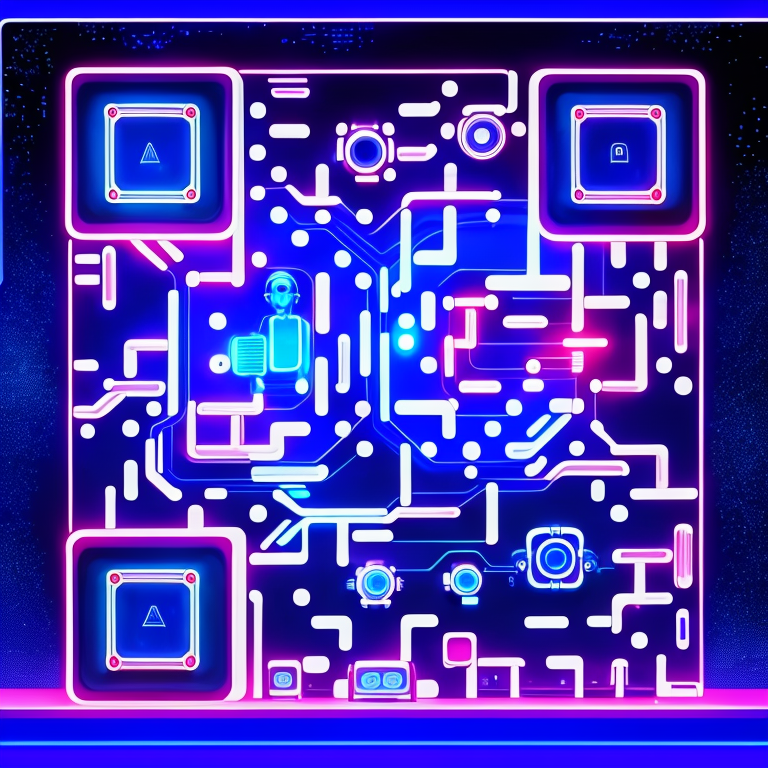

  

  
  
  
  
  
  
  
  
  
  
  
  

🔗[dcg0.github.io/DC-laboratory]

 Licencia y contacto

Código abierto e innovación constante. Para ideas, colaboraciones o solicitudes de desarrollo, visita el [sitio oficial](https://dcg0.github.io/DC-laboratory/) o el perfil de [GitHub](https://github.com/dcg0).
