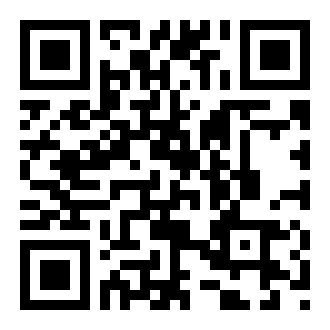

# DC Laboratory

  

<h1 align="center">⚡ D-C laboratory</h1>

<strong>Proyectos · Diagnóstico automotriz · Telemetría · IA · Automatización</strong>

  
  
  

## Sitio oficial

DC Laboratory es un portfolio vivo de herramientas y sistemas construidos para conectar software con el mundo real. La página reúne los proyectos del laboratorio, enlaces de producto, descargas verificadas y señales de estado de las builds.

**Abrir la página:** [dcg0.github.io/DC-laboratory](https://dcg0.github.io/DC-laboratory/)

  

Escanea este QR para abrir el sitio oficial de DC Laboratory.

## Builds disponibles

| Proyecto | Estado | Descarga | Verificación |
|---|---|---|---|
| **DC-ELM327** | **READY / RELEASE** | [APK desde GitHub Actions](https://api.github.com/repos/dcg0/DC-ELM327/actions/artifacts/10832181070/zip) | [Build exitosa](https://github.com/dcg0/DC-ELM327/actions/runs/36054606726) |
| **DC-ELM327 HC** | **READY / RELEASE** | [app-release.apk](https://github.com/dcg0/DC-elm327HC/releases/download/v0.1.0/app-release.apk) | [SHA-256](https://github.com/dcg0/DC-elm327HC/releases/download/v0.1.0/SHA256SUMS.txt) |
| **DCADMIN** | **READY / APK** | [DCA-ChromeOS.apk](downloads/DCA-ChromeOS.apk) | [SHA-256](downloads/DCA-ChromeOS.apk.sha256) |

> Las insignias **READY** se muestran únicamente cuando existe una build publicable comprobada. Los proyectos que todavía no tienen una compilación release verificada permanecen sin esa insignia.

## Seguridad

El workflow [`Security checks`](.github/workflows/security.yml) revisa patrones de secretos, valida el checksum SHA-256 del APK publicado y comprueba que los enlaces externos con `target="_blank"` incluyan `rel="noopener"`.

Para reportar una vulnerabilidad, consulta [`SECURITY.md`](SECURITY.md).

## Licencia y contacto

Código abierto e innovación constante. Para ideas, colaboraciones o solicitudes de desarrollo, visita el [sitio oficial](https://dcg0.github.io/DC-laboratory/) o el perfil de [GitHub](https://github.com/dcg0).
